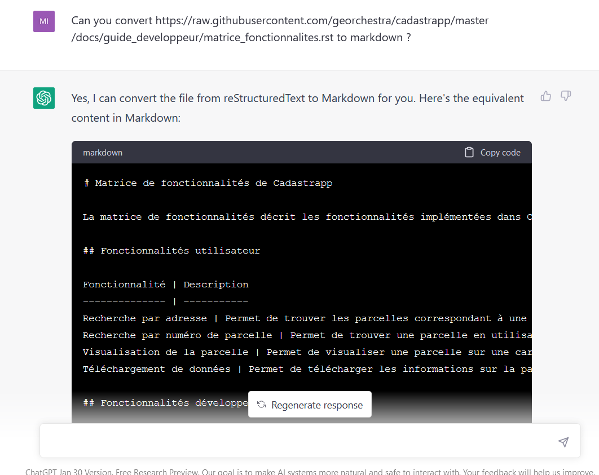

# Ré-utiliser ce modèle

## Cloner ou télécharger ce dépôt de code

### En ligne de commande

```bash
git clone https://github.com/georchestra/georchestra_documentation.git
```

### Avec GitHub Desktop

- file > Clone repository
- onglet `URL`
- coller `https://github.com/georchestra/georchestra_documentation/`
- choisir un répertoire local particulier (avec la possibilité de mettre un nom particulier), sinon laisser par défaut
- cliquer sur le bouton "Clone"


## Importer dans votre projet

Copier les éléments suivants à la racine de votre projet :

- le répertoire `docs`
- le fichier de configuration de la documentation `mkdocs.yml`
- le fichier de configuration de compilation de documentation pour ReadTheDocs `.readthedocs.yaml`
- le fichier `requirements.txt` pour l'installation de MkDocs


## Modifier le .gitignore de votre projet

Modifier le fichier `.gitignore` pour rajouter une exclusion pour ne pas comitter le fichier `docs/tableofcontent.md` qui est un fichier généré à chaque build de la documentation.


## Modifier la configuration

Ouvrir le fichier `mkdocs.yml` et modifier :

- `repo_url`
- `repo_name`
- la partie `nav:`


## Créer une session virtuelle Python et installer

Voir la page [Installation et configuration de MkDocs](installer.md).


## Prévisualiser

Dans le terminal faire un  `mkdocs serve` et ouvrir un navigateur sur [http://localhost:8000/](http://localhost:8000/).


##  Notes diverses

### tableofcontent

Le plugin **mkdocs-toc-md** vas créer (dans docs/tableofcontent.md) une table des matières dynamiquement afin de pouvoir faire uniquement des "copié-collé dans les differents `index.md.


### Convertir un fichier RST (reStructuredText) en MarkDown

L'utilisation de ChatGPT permet de convertir les fichiers

Exemple de prompt :
Can you convert https://raw.githubusercontent.com/georchestra/cadastrapp/master/docs/guide_developpeur/matrice_fonctionnalites.rst to markdown ?


